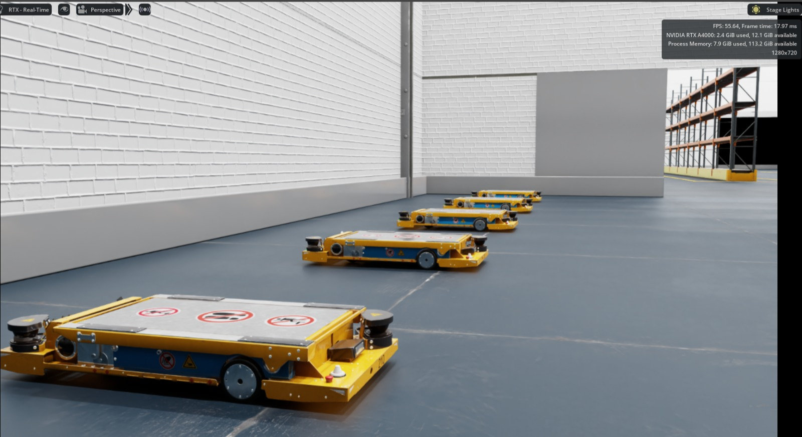

# Mobile-Robot-Fleet-Management-System-in-NVIDIA-Isaac-Sim

<video src="https://github.com/rohithmeti/Multi-AMR-Fleet-Coordination-Isaac-Sim-OpenRMF/raw/main/docs/videos/fleet_simulation.mp4" controls="controls" muted="muted" style="max-height:640px; width:100%;"></video>




**Note:** This repository and its dependencies are strictly built for **ROS 2 Humble**. Ensure you are on the correct ROS 2 distribution before proceeding.

## Overview
This repository contains a complete, ready-to-run setup for simulating and validating multi-robot fleet coordination and dynamic task scheduling. The system integrates **NVIDIA Isaac Sim** for high-fidelity physics, the **ROS 2 Navigation Stack (Nav2)** for local autonomy, and **Open-RMF** for centralized fleet management and traffic deconfliction.

We demonstrate how a fleet of five Autonomous Mobile Robots (AMRs) can navigate a constrained warehouse environment, avoiding deadlocks in narrow aisles using a custom schedule-based traffic adapter.

## System Architecture & Key Components

1. **Simulation Environment (Isaac Sim):** We simulate a fleet of 5 `iw_hub` industrial differential-drive AMRs inside a realistic USD warehouse environment. Each AMR is equipped with dual RTX-accelerated 2D LiDARs.
2. **ROS 2 Bridge & Navigation:** Data from Isaac Sim is streamed directly to a ROS 2 network using the ROS Bridge. In the backend, each robot runs its own independent Nav2 stack.
3. **Open-RMF & Custom Tweaks:** The fleet is orchestrated by Open-RMF. Because Isaac Sim introduces high system constraints and physical delays (unlike idealized 2D simulators), we have tweaked several underlying C++ (`.cpp`/`.hpp`) files within the Open-RMF core to handle these delays gracefully. *(See `ros2_team001/src/rmf/README.md` for details on these modifications).*
4. **Simulator-Based Fleet Adapters & RobotClient API:** The connection between Open-RMF and the Nav2 stacks is handled by our Fleet Adapter. We utilize a simulated `iw_hub_fleet_config` and an adjusted RobotClient API that translates RMF destination commands into Nav2 `NavigateToPose` actions while streaming the robot's real-time battery and position state back to the dispatcher.
5. **Task Generation (WMS Script):** We use a custom Warehouse Management System (WMS) Python script located at `scripts/wms_v2.py` to programmatically generate and dispatch tasks (like patrols and deliveries) to the fleet.

## Setup and Installation

### 1. NVIDIA Isaac Sim Setup
1. **Download the Environment:** Extract the Isaac Sim USD files (`Collected_Custom_Warehouse_lighting`) into a dedicated folder.
2. **Install Isaac Sim:** You must install **NVIDIA Isaac Sim version 4.5 or above** (mandatory for compatibility).
3. **Enable ROS Bridge:** Launch Isaac Sim and ensure the ROS 2 Bridge extension is enabled.
4. Load the `Custom_Warehouse_lighting.usd` environment.

### 2. ROS 2 Workspace Setup
This workspace is designed to be easily cloned and built on any machine running Ubuntu and ROS 2 Humble. All file paths are relative to the workspace.

```bash
# Clone this repository
git clone https://github.com/rohithmeti/Multi-AMR-Fleet-Coordination-Isaac-Sim-OpenRMF.git
cd Multi-AMR-Fleet-Coordination-Isaac-Sim-OpenRMF/ros2_team001

# Source ROS 2 Humble
source /opt/ros/humble/setup.bash

# Build the entire workspace (Nav2, Adapters, and tweaked Open-RMF)
colcon build --symlink-install --cmake-args -DCMAKE_BUILD_TYPE=Release

# Source the built workspace
source install/setup.bash
```
*Note: The `team_venv` folder contains the Python virtual environment with specific dependencies (like WebSockets) required for the simulation.*

If you need to create your own virtual environment from scratch instead of using `team_venv`, here are the core third-party Python libraries required for the fleet adapter and WMS scripts to function (these are independent of the standard ROS 2 Python libraries):

```bash
python3 -m venv ~/my_rmf_venv
source ~/my_rmf_venv/bin/activate
pip install Flask==2.0.1 Flask-SocketIO==5.0.1 fastapi==0.63.0 uvicorn==0.15.0 websockets==10.4
pip install numpy scipy pandas Shapely pyproj
pip install requests PyYAML
```
*(Make sure you also build and source the `rmf_fleet_adapter_python` package in your ROS workspace so the `rmf_adapter` bindings are available to your python scripts!)*

## Launch Instructions

To launch the full pipeline, open **8 separate terminals**. In *every* terminal, navigate to the workspace and source the setup file first:
```bash
cd ~/path/to/Multi-AMR-Fleet-Coordination-Isaac-Sim-OpenRMF/ros2_team001
source install/setup.bash
```

Run the following commands in order:

**Terminal 1: LiDAR Merger**
*(Wait for the node to start publishing `/iw_hub_X/scan_merged_1` for each robot)*
```bash
ros2 launch ira_laser_tools merger_iw_hub_lidar.launch.py
```

**Terminal 2: Navigation Stack**
*(Wait until you see all 5 robots print `[bond] Created bond ... timer active`)*
```bash
ros2 launch iw_hub_navigation multi_iw_hub_navigation.launch.py
```

**Terminal 3: RMF Traffic Scheduler**
```bash
ros2 run rmf_traffic_ros2 rmf_traffic_schedule --ros-args -p use_sim_time:=true
```

**Terminal 4: RMF Task Dispatcher**
```bash
source team_venv/bin/activate
ros2 run rmf_task_ros2 rmf_task_dispatcher --ros-args -p use_sim_time:=true
```

**Terminal 5: Fleet Adapter**
*(Wait until all 5 robots print `[iw_hub_X] Snapped to graph waypoint N on L1`)*
```bash
source team_venv/bin/activate
export PYTHONPATH=$PWD/team_venv/lib/python3.10/site-packages:$PYTHONPATH
ros2 run iw_fleet_adapter fleet_adapter \
  -c src/iw_fleet_adapter/iw_hub_fleet_config.yaml \
  -n src/iw_fleet_adapter/0.yaml \
  -sim
```

**Terminal 6: WMS Task Dispatcher**
*(Run this to start assigning tasks to the robots)*
```bash
source team_venv/bin/activate
python3 scripts/wms_v2.py
```

**Terminal 7: RViz2 (Optional Visualizer)**
```bash
ros2 run rviz2 rviz2
```

**Terminal 8: RMF NavGraph Viewer**
```bash
ros2 run rmf_visualization_navgraphs navgraph_visualizer_node --ros-args -p use_sim_time:=true
```

## RMF Map and Navigation Alignment

A critical part of successfully deploying Open-RMF with local Nav2 stacks is ensuring that the **RMF topological map origin and the Nav2 local occupancy grid map origin are perfectly matched.** If these origins drift or are misaligned, the coordinates Open-RMF sends to the robots will not match the physical layout of the warehouse, leading to severe pathing failures and collisions.

To ensure robots drive to the correct physical locations, the **RMF topological map origin** and the **Nav2 local occupancy grid map origin** must be perfectly matched. If they drift, the fleet adapter will issue goals into walls or out of bounds.

We built our map using a strict **unidirectional node-lane topology** (meaning AMRs are forced to travel in one-way lanes to prevent head-on collisions in narrow aisles). Because the legacy `traffic_editor` struggles with coordinate origin manipulation, **we highly recommend using the new web-based `rmf_site_editor`** to annotate your maps.

We have included two vital custom scripts in the `scripts/` directory to mathematically guarantee perfect origin alignment, which is critical if you are adapting this repository to a completely **new warehouse map**.

### Origin Alignment & Map Generation Workflow

**1. Extract Nav2 Map Data:** 
Run our `rmf_origin.py` script, providing the paths to your ROS `map.yaml` and `map.pgm` files:
```bash
python3 scripts/rmf_origin.py
```
**Logic:** This script parses the `resolution` and `origin` vectors from the ROS YAML, reads the pixel dimensions from the PGM header, and uses trigonometry to compute the exact top-left RMF origin coordinates (`rmf_origin_x` and `rmf_origin_y`).

**2. Configure the RMF Site Editor:**
* Open the [RMF Site Editor](https://open-rmf.github.io/rmf-site-editor/) and add your `.pgm` or `.png` map as a drawing.
* In the drawing properties panel, enter the calculated scale (pixels/meter) generated by the script.
* Enter the calculated `rmf_origin_x` and `rmf_origin_y` values into the X and Y offset fields.
* Annotate your map with unidirectional lanes, waypoints, chargers, and parking spots. Save the project as `warehousermf.site.json`.

**3. Convert JSON to Building YAML:** 
Run our `convert_json_to_building_yaml.py` script. 
```bash
python3 scripts/convert_json_to_building_yaml.py
```
**Logic:** This script reads the `warehousermf.site.json` outputted by the site editor. It scales the vertices from meters to pixels, **flips the Y-axis** to match RMF`s inverted coordinate system (`-y * ppm`), injects a scaling measurement, and outputs a properly formatted `warehousermf.building.yaml` file.

**4. Generate the Navigation Graph:** 
Use the standard ROS 2 `rmf_building_map_tools` package to compile the building YAML into a navigation graph required by the fleet adapter:
```bash
ros2 run rmf_building_map_tools building_map_generator nav warehousermf.building.yaml .
```
This parses the `building.yaml` and outputs the `0.yaml` nav-graph file containing all the nodes and edges required by the Open-RMF fleet adapter to safely route the robots.

---

**Keywords / Search Tags:** `Open-RMF Simulation`, `NVIDIA Isaac Sim`, `AMR Fleet Management`, `ROS 2 Humble`, `Multi-Robot Coordination`, `Traffic Deconfliction`, `Autonomous Mobile Robots`, `OpenRMF Fleet Adapter`, `RobotClientAPI`, `Warehouse Automation Simulation`, `ROS 2 Nav2`, `Digital Twin`
